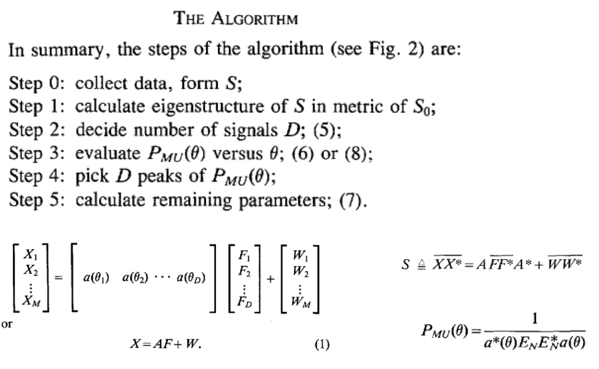

# MUSIC-source-separation

This is an implemention of the MUltiple SIgnal Classification (MUSIC) algorithm as introduced in [1]. It is implemented for the purpose of audio source localization using a simple audio propagation model that only accounts for signal attenuation. We compare MUSIC against a simple baseline of Independent Component Analysis (ICA), which attempts to separate the audio sources blindly, without knowledge of the array geometry. 

This notebook is the result of a weekend project I did in October 2021 with the goal of learning more about audio source separation algorithms. To date, I have found that the algorithms work amazingly well on simulated data, but there is still room for improvement on actual experimental data. As next steps I would like to perform some experiments to better characterize the hardware microphone array and explore more complex models of sound wave propagation that account for time of arrival as well as phase differences. 

The following notebook is the main entry point to the code:
https://github.com/maidens/MUSIC-source-separation/blob/main/Source%20Separation%20using%20the%20MUSIC%20algorithm.ipynb
There are audio clips in the notebook that help illustrate performance of the algorithm. But unfortunately GitHub's Jupyter Notebook rendering does not currently render IPython Audio objects (as of October 2021). So you will need to clone and run the notebook locally to listen to the audio. 

At a high level, the MUSIC algorithm works by computing "signal" and "noise" subspaces using the covariance matrix of the measured data, then identifying the sources as the locations farthest from the noise subspace. The steps of the MUSIC algorithm, as written in the original paper [1], are outlined below. In my implementation I have attempted to assign variable names to match the nomenclature used in the original paper as much as possible. 

[1] Schmidt, R. (1986). Multiple emitter location and signal parameter estimation. IEEE transactions on antennas and propagation, 34(3), 276-280. Available: [here](https://msol.people.uic.edu/ECE531/papers/Multiple%20Emitter%20Location%20and%20Signal%20Parameter%20Estimation.pdf)
